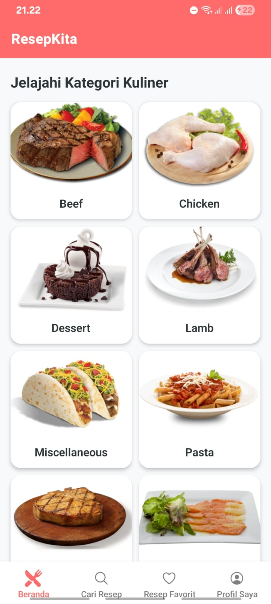
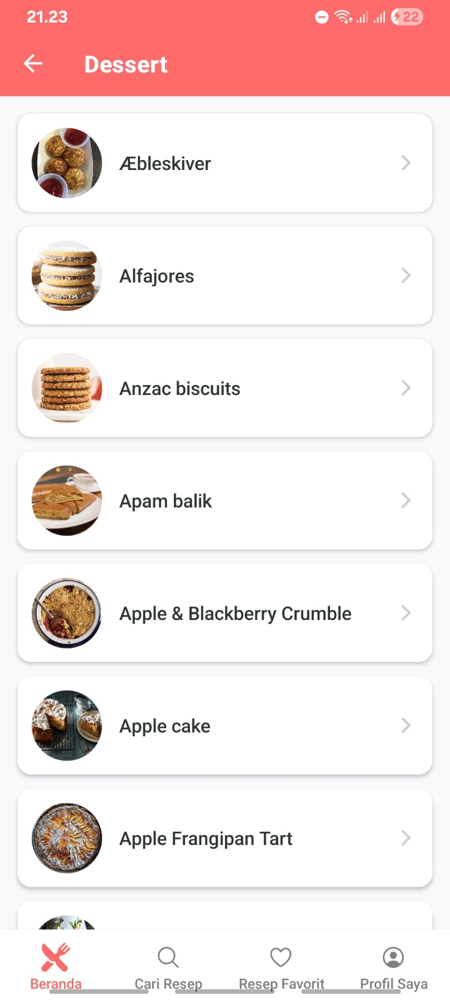
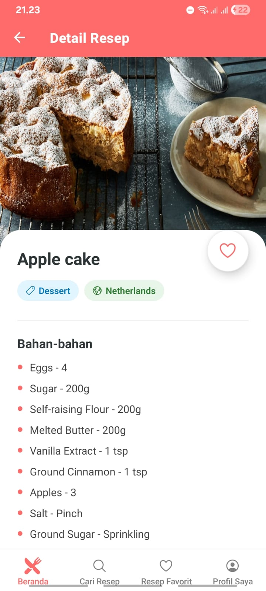
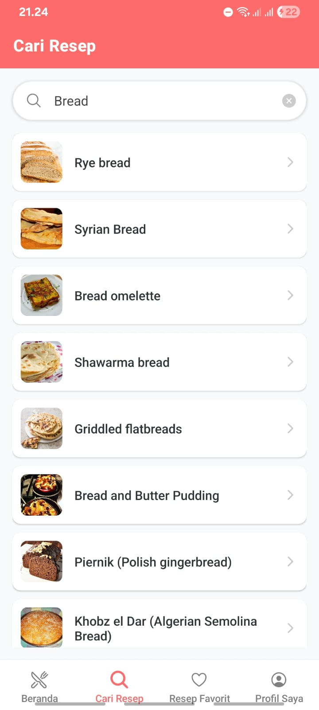
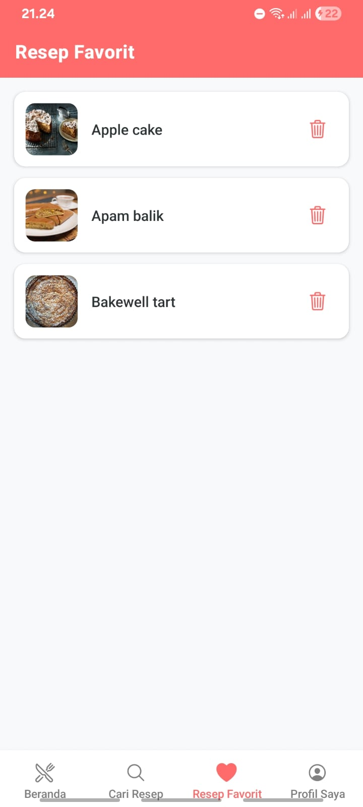

# UTS Pemrograman Mobile Lanjut - ResepKita

### Informasi Mahasiswa
- **Nama:** Muhammad Faisal Rahman
- **NIM:** 2410501066
- **Kelas:** D3 Sistem Informasi
- **Instansi:** UPN "Veteran" Jakarta

---

## 1. Tema yang Dipilih
**Tema A: ResepKita - Katalog Resep Kuliner**
Aplikasi ini menyajikan daftar resep masakan yang diambil secara dinamis dari API publik, memungkinkan pengguna mencari resep, melihat detail bahan serta instruksi memasak, dan menyimpan resep favorit.

---

## 2. Tech Stack yang Digunakan
Berdasarkan `package.json`, proyek ini menggunakan:
- **Framework:** React Native (Expo SDK 50/51)
- **Library Navigasi:** - `@react-navigation/native` (v6.x)
  - `@react-navigation/native-stack`
  - `@react-navigation/bottom-tabs`
- **State Management:** `Zustand` (v4.x)
- **HTTP Client:** `Axios` (v1.x)
- **Icons:** `@expo/vector-icons` (Ionicons)
- **Environment:** Node.js & npm

---

## 3. Cara Install & Run
Ikuti langkah-langkah berikut untuk menjalankan proyek di lokal:

1. **Clone Repository**
   ```bash
   git clone https://github.com/FaisalRahman-stack/uts-mobile-lanjut-2410501066-M.FaisalRahman.git
   cd uts-mobile-lanjut

2. **Install Dependencies**
   ```bash
   npm install
   
3. **Menjalankan Proyek**
   ```bash
   npx expo start

---

## 4. Screenshots
a. Home Screen


b. Browse Screen


3. Detail Screen


4. Search Screen


5. Favorites Screen


6. About Screen


---

## 5. Video Demo
- Youtube : https://youtu.be/EhMZgnCmQgc?si=K8AQpzL3RkcUh60N

---

## 6. State Management & Justifikasi
Justifikasi Pemilihan:

a. Ringan & Cepat: Zustand memiliki ukuran library yang jauh lebih kecil dibandingkan Redux Toolkit, sehingga sangat cocok untuk aplikasi mobile skala menengah.

b. Tanpa Boilerplate: Tidak perlu membuat action, reducer, atau dispatch yang rumit. Cukup definisikan store dan gunakan sebagai hook.

c. Performa Optimal: Zustand meminimalkan re-render yang tidak perlu karena komponen hanya akan mengamati bagian state yang benar-benar dibutuhkan.

d. Intuitive: Sangat mudah diintegrasikan dengan functional component React Native.

---

## 7. Daftar Referensi
a. React Navigation Documentation

b. TheMealDB API Reference

c. Zustand GitHub Documentation

d. Axios Getting Started

e. Expo Vector Icons Directory

---

## 8. Refleksi Pengerjaan
Selama mengerjakan proyek UTS "ResepKita", saya mendapatkan banyak wawasan baru mengenai pengembangan aplikasi mobile berbasis data real-time. Tantangan pertama yang saya hadapi adalah manajemen struktur data dari API TheMealDB. API ini tidak menyediakan daftar bahan (ingredients) dalam bentuk array, melainkan properti terpisah dari strIngredient1 hingga strIngredient20. Hal ini memaksa saya untuk memutar otak dan membuat logika perulangan (looping) khusus di sisi frontend untuk menggabungkan bahan dan takaran agar bisa ditampilkan secara rapi di layar detail.

Selain itu, saya sempat mengalami bug teknis berupa warning Maps with payload was not handled by any navigator. Kesalahan ini terjadi karena saya mencoba menavigasi pengguna ke halaman Detail dari Tab Search, namun halaman Detail tersebut belum terdaftar dalam stack navigasi di bawah Tab tersebut. Melalui dokumentasi React Navigation, saya belajar cara mengimplementasikan nested navigation yang benar dengan membuat Stack Navigator terpisah untuk setiap tab.

Proses pengerjaan ini juga melatih saya dalam melakukan styling UI/UX yang modern. Saya belajar menerapkan tema warna konsisten, menggunakan ikon vektor, serta menangani skenario offline menggunakan error handling dan fitur pull-to-refresh. Pengalaman ini sangat berharga dalam memperdalam pemahaman saya mengenai integrasi API, state management dengan Zustand, dan siklus hidup komponen dalam React Native.
